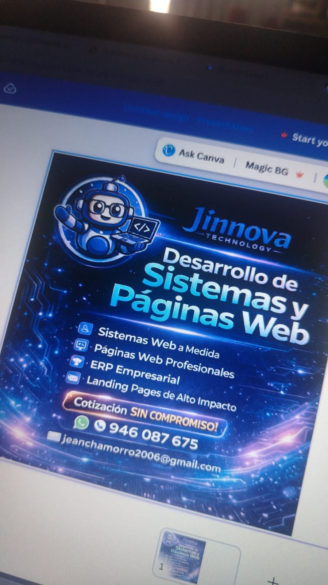

<div align="center">

<!-- Typing Animation -->
<a href="https://git.io/typing-svg">
  
</a>

<!-- Social Badges -->
<p>
  <a href="https://github.com/Jeanfranco2006">
    
  </a>
  <a href="https://linkedin.com/in/jeanchamorro">
    
  </a>
  <a href="mailto:jean.chamorro@jinnova.tech">
    
  </a>
  <a href="https://jinnova.tech">
    
  </a>
</p>


</div>

<br/>

<!-- About Section -->
##  Sobre mí

```javascript
const jean = {
    rol: "Arquitecto de Software & Full Stack Developer",
    empresa: "CEO @ Jinnova Technology",
    experiencia: "+5 años construyendo soluciones escalables",
    ubicacion: "Perú 🇵🇪",

    stack: {
        backend: ["Java", "Spring Boot", "PHP", "Laravel", "Node.js"],
        frontend: ["React", "Next.js", "Vue.js", "TypeScript"],
        databases: ["MySQL", "PostgreSQL", "MongoDB"],
        devops: ["Docker", "Linux", "Git", "Apache Tomcat"]
    },

    actualmente: {
        aprendiendo: ["Rust", "Next.js Avanzado"],
        trabajando: "ERP Peru Market v2",
        leyendo: "Clean Architecture",
        objetivo2026: "Certificación AWS"
    },

    filosofia: "La mejor arquitectura es aquella que resuelve problemas complejos con soluciones simples."
};
```

<br/>

<!-- Tech Stack -->
##  Tech Stack

<div align="center">

<!-- Backend -->
<details open>
<summary><b>⚙️ Backend</b></summary>
<br/>

</details>

<!-- Frontend -->
<details open>
<summary><b>🎨 Frontend</b></summary>
<br/>

</details>

<!-- Database & DevOps -->
<details open>
<summary><b>🗄️ Database & DevOps</b></summary>
<br/>

</details>

<!-- Exploring -->
<details>
<summary><b>🔮 Explorando</b></summary>
<br/>

</details>

</div>

<br/>

<!-- GitHub Stats -->
##  GitHub Analytics

<div align="center">

<a href="https://github.com/Jeanfranco2006">
  
  
</a>

<!-- Streak Stats -->


<!-- Activity Graph -->


<!-- GitHub Trophies -->


</div>

<!-- Snake Animation -->
<div align="center">
  <picture>
    <source media="(prefers-color-scheme: dark)" srcset="https://raw.githubusercontent.com/Jeanfranco2006/Jeanfranco2006/output/github-snake-dark.svg" />
    <source media="(prefers-color-scheme: light)" srcset="https://raw.githubusercontent.com/Jeanfranco2006/Jeanfranco2006/output/github-snake.svg" />
    
  </picture>
</div>

<br/>

<!-- Projects -->
##  Proyectos Destacados

<table>
<tr>
<td width="50%" valign="top">

<h3 align="center">🏫 Sistema de Colegio</h3>

<div align="center">
  
</div>

<br/>

**Sistema de gestión educativa completo**


- ✦ Gestión de estudiantes y profesores
- ✦ Control de notas y asistencia
- ✦ Reportes académicos automáticos
- ✦ Sistema de comunicados

</td>
<td width="50%" valign="top">

<h3 align="center">📦 ERP Peru Market</h3>

<div align="center">
  
</div>

<br/>

**Sistema ERP para gestión empresarial**


- ✦ Control de inventario inteligente
- ✦ Gestión de ventas y facturación
- ✦ Reportes financieros en tiempo real
- ✦ Módulo de compras y proveedores

</td>
</tr>
<tr>
<td width="50%" valign="top">

<h3 align="center">🍽️ Sistema Restaurante</h3>

<br/>

**Sistema multi-rol para restaurantes**


- ✦ 4 roles: Admin, Mesero, Cocina, Caja
- ✦ Gestión de pedidos en tiempo real
- ✦ Facturación y cierre de mesas
- ✦ Panel de control completo

</td>
<td width="50%" valign="top">

<h3 align="center">🏠 InmoBlock </h3>

<br/>

**Plataforma inmobiliaria blockchain**


- ✦ Tokenización de propiedades
- ✦ Smart contracts en Syscoin
- ✦ Integración con PaliWallet
- ✦ 🏆 **2do lugar Hackathon Syscoin**

</td>
</tr>
</table>

<br/>

<!-- Contact Section -->
##  Conectemos

<div align="center">

**¿Tienes un proyecto en mente? ¡Construyámoslo juntos!**

<br/>

<a href="https://calendly.com/tu-usuario">
  
</a>
<a href="mailto:jean.chamorro@jinnova.tech">
  
</a>

<br/><br/>


</div>

<br/>

---

<div align="center">

<!-- Quick Stats -->


<br/><br/>

<a href="https://git.io/typing-svg">
  
</a>

<br/>

**© 2026 Jean Chamorro | [Jinnova Technology](https://jinnova.tech) | Hecho con 💙 desde Perú 🇵🇪**

</div>


