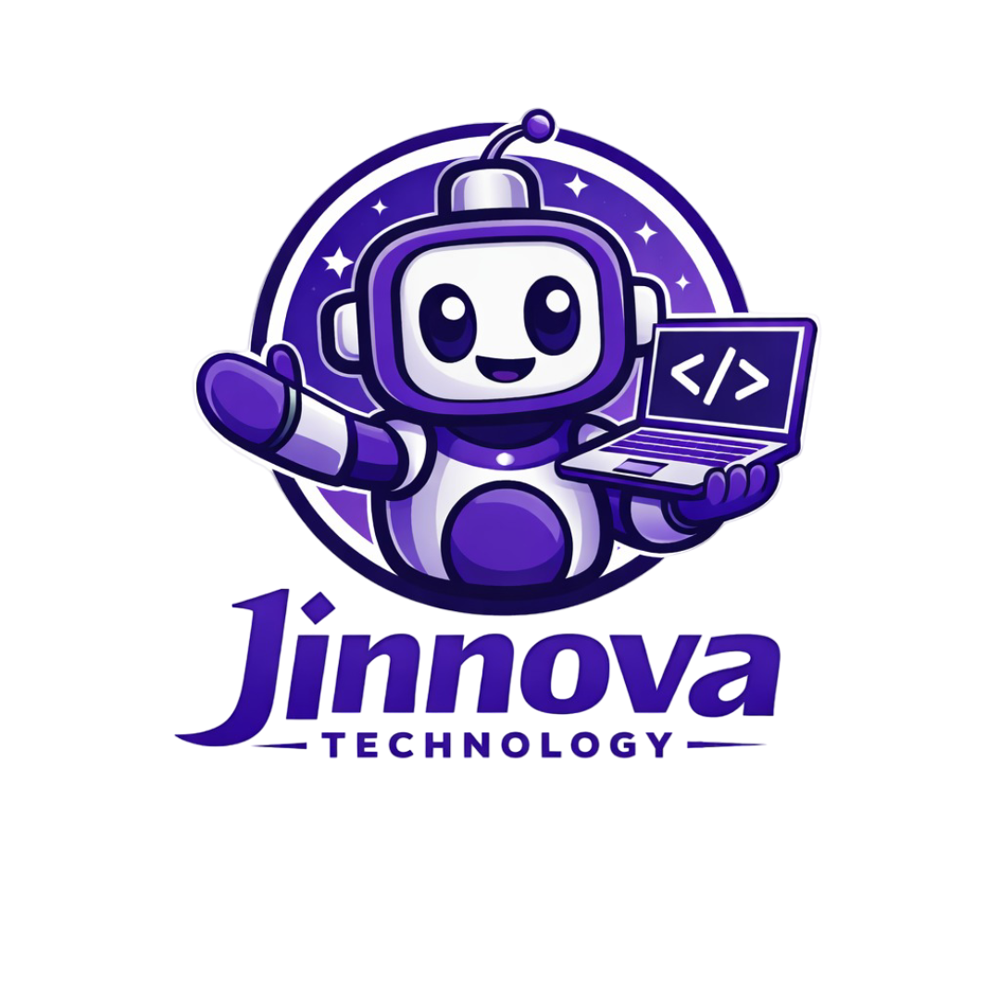
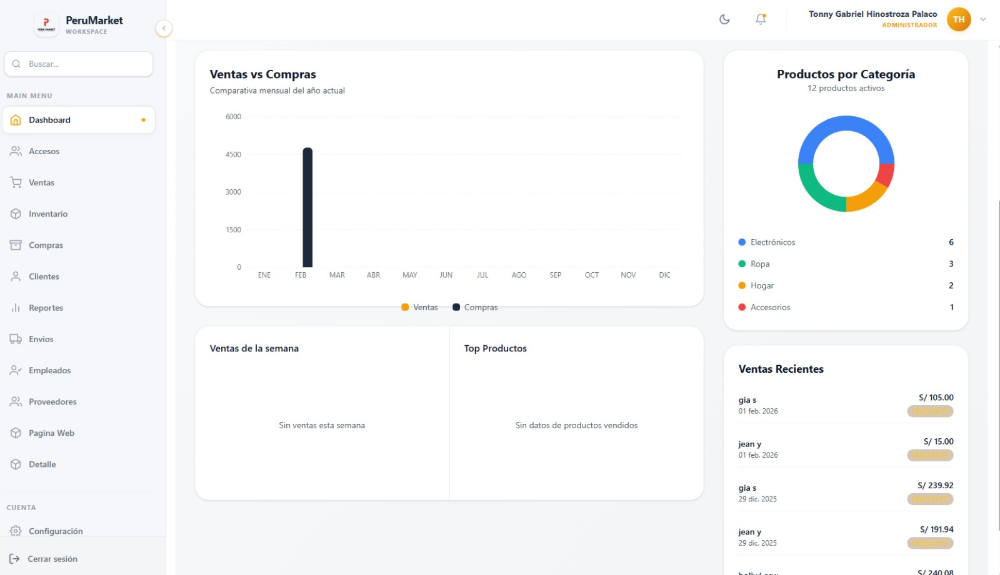
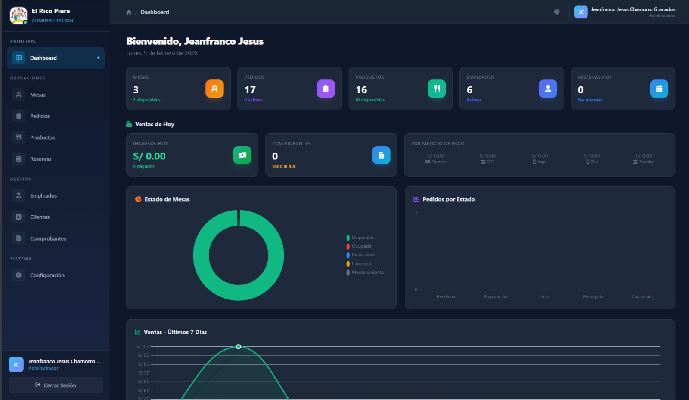

<div align="center">

<!-- Robot Typing Animation -->
<a href="https://git.io/typing-svg">
  
</a>

<br/>

<!-- Social Badges -->
<a href="https://github.com/Jeanfranco2006">
  
</a>
<a href="https://linkedin.com/in/jeanchamorro">
  
</a>
<a href="mailto:jean.chamorro@jinnova.tech">
  
</a>
<a href="https://jinnova.tech">
  
</a>

<br/><br/>


</div>

<br/>

<!-- About Section -->
## 🤖 Sobre mí

<table>
<tr>
<td width="65%" valign="top">

<br/>

### ⚡ ¡Hola! Soy Jean Chamorro

**Arquitecto de Software** con más de **5 años de experiencia** construyendo soluciones escalables y robustas.

<br/>

```yaml
🏢 Rol: CEO & Fundador @ Jinnova Technology
☕ Stack: Java, Spring Boot, PHP, Laravel
🎯 Enfoque: Arquitecturas limpias y microservicios
🔐 Pasión: Seguridad informática
🎓 Misión: Mentor en comunidades dev
📍 Base: Perú 🇵🇪
```

<br/>

> *"La mejor arquitectura es aquella que resuelve problemas complejos con soluciones simples."*

</td>
<td width="35%" align="center" valign="middle">



<br/><br/>

**🚀 Jinnova Technology**

*Transformando ideas en productos digitales*

</td>
</tr>
</table>

<br/>

<!-- Status -->
<div align="center">

| 🌱 Aprendiendo | 🔭 Trabajando en | 📚 Leyendo | 🎯 Meta 2026 |
|:--------------:|:----------------:|:----------:|:------------:|
| `Rust` `Next.js` | ERP Peru Market v2 | Clean Architecture | AWS Certified |

</div>

<br/>

<!-- Tech Stack -->
## ⚙️ Tech Stack

<div align="center">

<br/>

**`// BACKEND`**


<br/><br/>

**`// FRONTEND`**


<br/><br/>

**`// DATABASE & DEVOPS`**


<br/><br/>

**`// EXPLORING`**


</div>

<br/>

<!-- GitHub Stats -->
## 📊 GitHub Analytics

<div align="center">

<a href="https://github.com/Jeanfranco2006">
  
  
</a>

<br/><br/>

<!-- Streak Stats -->


<br/><br/>

<!-- Activity Graph -->


<br/><br/>

<!-- GitHub Trophies -->


</div>

<br/>

<!-- Projects -->
## 🚀 Proyectos Destacados

<br/>

<table>
<tr>
<td width="50%" align="center">



<br/>

### 📦 ERP Peru Market

**Sistema ERP completo para gestión empresarial**

<br/>


<br/>

```
✦ Control de inventario inteligente
✦ Gestión de ventas y facturación
✦ Reportes financieros real-time
✦ Módulo de compras
```

</td>
<td width="50%" align="center">



<br/>

### 🍽️ Rico Piura

**Sistema de gestión para restaurantes**

<br/>


<br/>

```
✦ Sistema multi-rol completo
✦ Gestión de pedidos real-time
✦ Facturación y cierre de mesas
✦ Panel administrativo
```

</td>
</tr>
</table>

<br/>

<table>
<tr>
<td width="50%" align="center">

### 🏫 Sistema de Colegio

**Sistema de gestión educativa completo**

<br/>


<br/>

```
✦ Gestión de estudiantes
✦ Control de notas
✦ Reportes automáticos
```

</td>
<td width="50%" align="center">

### 🏠 InmoBlock &nbsp; 

**Plataforma inmobiliaria blockchain**

<br/>


<br/>

```
✦ Tokenización de propiedades
✦ Smart contracts Syscoin
🏆 Hackathon Syscoin Winner
```

</td>
</tr>
</table>

<br/>

<!-- Contact Section -->
## 📬 Conectemos

<div align="center">

<br/>

### 🤖 ¿Tienes un proyecto en mente?

**`// SYSTEM.READY() → LET'S BUILD TOGETHER`**

<br/>

<a href="https://calendly.com/tu-usuario">
  
</a>
&nbsp;&nbsp;
<a href="mailto:jean.chamorro@jinnova.tech">
  
</a>

<br/><br/>

`⚡ RESPONSE_TIME: < 24h`

</div>

<br/>

---

<br/>

<div align="center">


&nbsp;

&nbsp;


<br/><br/>

<a href="https://git.io/typing-svg">
  
</a>

<br/><br/>

**`© 2026 JEAN CHAMORRO`** | **[JINNOVA.TECH](https://jinnova.tech)**

**`MADE WITH 💜 FROM PERU 🇵🇪`**

<br/>


</div>


